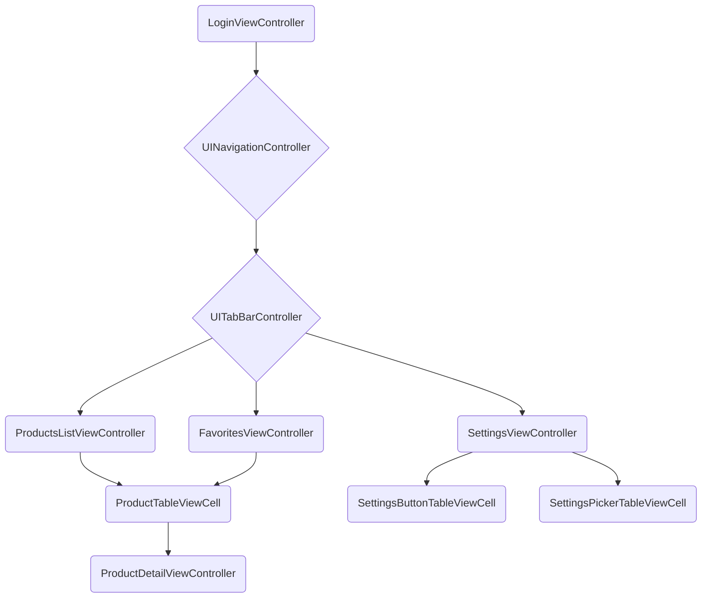

# IBI Products Store

## Introduction
Welcome to the IBI Products Store app, an iOS application designed to demonstrate key iOS development skills, including local storage, biometric authentication, API interaction, response parsing, and UI component utilization. This app consists of four main screens: Login, Products List, Settings, and Favorites.

## Features
### Login Screen
- **Username & Password Login**: Simulated login maintained locally with a provided test (username = `admin`) and (password = `password`).
- **Biometric Authentication**: Login using **Touch ID/Face ID**.
- **Lottie Animation**: Adds visual appeal above the login fields.

### Products List
- **API Integration**: Fetches product data from [dummyjson.com/products](https://dummyjson.com/products).
- **Product Display**: Shows title, description, price, brand, and thumbnail for each product in a table view.
- **Detail View**: Tapping a product shows its detailed information.
- **Image Caching**: Uses a caching library for efficient image loading.
- **Pagination**: Implements pagination for smooth scrolling and performance optimization.
- **Reset Option**: Reverts all changes by fetching fresh data from the server.
-  **Product Management**: Swipe to delete products locally.

### Settings Screen
- **Dark Mode/Light Mode**: Toggle between dark and light themes using UserDefaults.
- **Language Support**: Switch between Hebrew and English without restarting the app using UserDefaults.
- **Logout**: Log out from the account.

### Favorites Screen
- **Favorite Products**: Add and manage favorite products.
- **Local Storage**: Saves favorites on the device using SwiftData.

## Project Setup
1. **Xcode**: Create a new iOS project using Xcode.
2. **Swift**: Use Swift as the programming language.
3. **UIKit**: Utilize UIKit for building the UI components.

## Architecture
- **MVVM Pattern**: The app is structured using the MVVM (Model-View-ViewModel) pattern with elements of MVC (Model-View-Controller) using Storyboards.

## Challenges
- **Language Switching**: Implementing seamless language switching between English and Hebrew without restarting the app was particularly challenging.
- **Clean Architecture**: Maintaining a clean and organized code architecture while incorporating various features was a significant focus.

## Implementation Details
### Login Screen
- **LoginViewController**: Contains `UITextField`s for username and password and a `UIButton` for login.
- **Biometric Authentication**: Uses `LocalAuthentication` framework.
- **Lottie Animation**: Integrates with the `Lottie` library.

### Products List
- **ProductsListViewController**: Uses a `UITableView` to display products.
- **API Fetching**: Uses `URLSession` to retrieve data.
- **Image Caching**: Implements `SDWebImage` for image caching.
- **Pagination**: Ensures smooth scrolling with `PaginableProductsTableViewController` and `PaginableDelegate`.

### Product Detail Screen
- **ProductDetailViewController**: Shows detailed product information.

### Settings Screen
- **SettingsViewController**: Contains controls for dark mode, language change, and logout.
- **UserDefaults**: Saves user preferences.

### Favorites Screen
- **FavoritesViewController**: Manages favorite products using SwiftData.

## Specs
- **Minimum Deployments**: `iOS 17.5`.
- **Swift**: `5`.
- **Third Party Libraries**:
    - [`Lottie` - `v4.4.3`](https://github.com/airbnb/lottie-ios.git).
    - [`SDWebImage` - `v5.19.4`](https://github.com/SDWebImage/SDWebImage.git).

## Flowchart for ViewControllers

